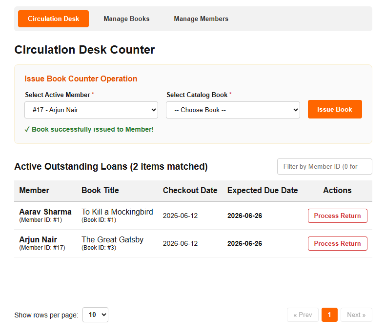
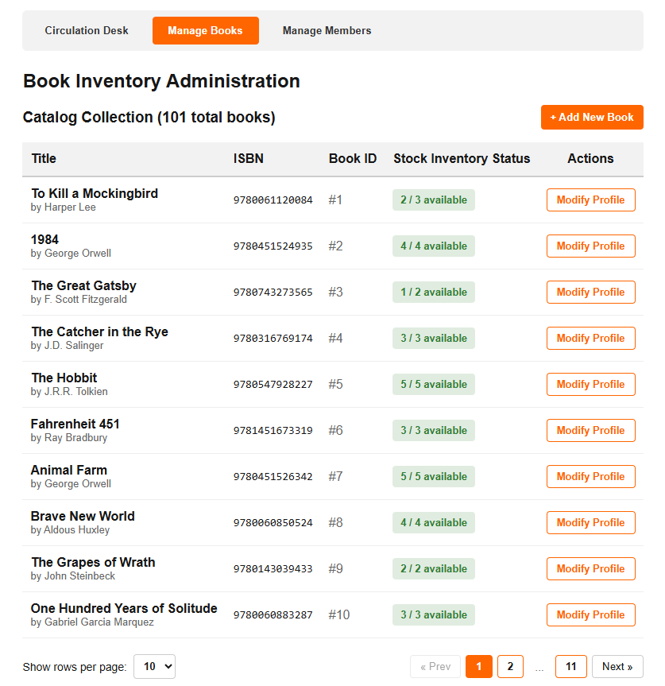
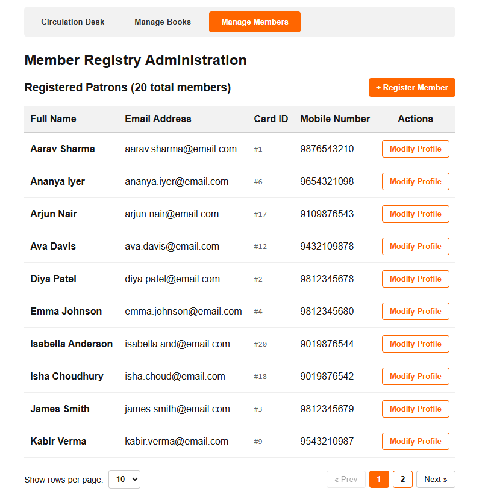

# library-management-system

## How to Run the Code

To get the application up and running, follow these steps:

1. **Navigate to the project folder:**
   ```bash
   cd library-management-system
   ```

2. **Start the containers:**
   Run the following Docker command to build and start the database, backend API, and frontend portal:
   ```bash
   docker compose up
   ```

3. **Access the UI:**
   Once the containers are running, open your web browser and navigate to:
   **[http://localhost:3000](http://localhost:3000)**

> **Note:** The database is pre-populated with **20 members** and **100 books** using the `init.sql` script so you can start testing the application immediately.

## User Interface (UI) Overview

The frontend UI is divided into 3 main parts:

### 1. Circulation Desk



A tab to issue (borrow) and return books for library patrons.

### 2. Manage Books



A section for managing the book inventory, adding new titles, and updating total copies.

### 3. Manage Members



A section to manage existing patron profiles or add new members to the library system.

## Database Schema

The PostgreSQL database consists of three primary tables configured via `init.sql`. They enforce strict data integrity rules, including non-empty string constraints, positive numerical limits, and chronological date logic.

### 1. `books` Table
Stores the library's catalog inventory.

| Column Name | Data Type | Constraints / Rules |
| :--- | :--- | :--- |
| `id` | SERIAL | Primary Key |
| `title` | VARCHAR(255) | Not Null, Non-empty string |
| `author` | VARCHAR(255) | Not Null, Non-empty string |
| `isbn` | VARCHAR(50) | Unique, Not Null, Non-empty string |
| `total_copies` | INT | Default `1`, Must be `>= 1` |
| `available_copies` | INT | Default `1`, Must be `>= 0` and `<= total_copies` |

### 2. `members` Table
Stores registered library patrons.

| Column Name | Data Type | Constraints / Rules |
| :--- | :--- | :--- |
| `id` | SERIAL | Primary Key |
| `name` | VARCHAR(255) | Not Null, Non-empty string |
| `email` | VARCHAR(255) | Unique, Not Null, Enforced lowercase, Must match email regex |
| `phone` | VARCHAR(20) | Unique, Optional, Non-empty string if provided |

### 3. `operations` Table
Acts as the ledger tracking the borrowing and returning of books.

| Column Name | Data Type | Constraints / Rules |
| :--- | :--- | :--- |
| `id` | SERIAL | Primary Key |
| `member_id` | INT | Foreign Key to `members(id)` |
| `book_id` | INT | Foreign Key to `books(id)` |
| `borrow_date` | DATE | Default `CURRENT_DATE` |
| `return_date` | DATE | Nullable, Must be `>= borrow_date` |
| `due_date` | DATE | Default `borrow_date + 14 days`, Must be `>= borrow_date` |

## Testing

See the detailed testing instructions in [README-Testing.md](README-Testing.md).